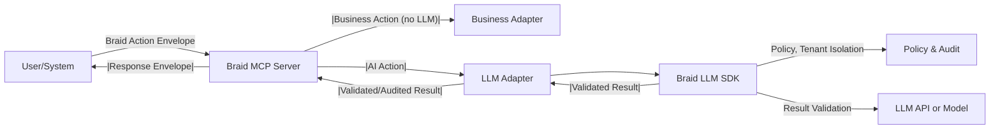
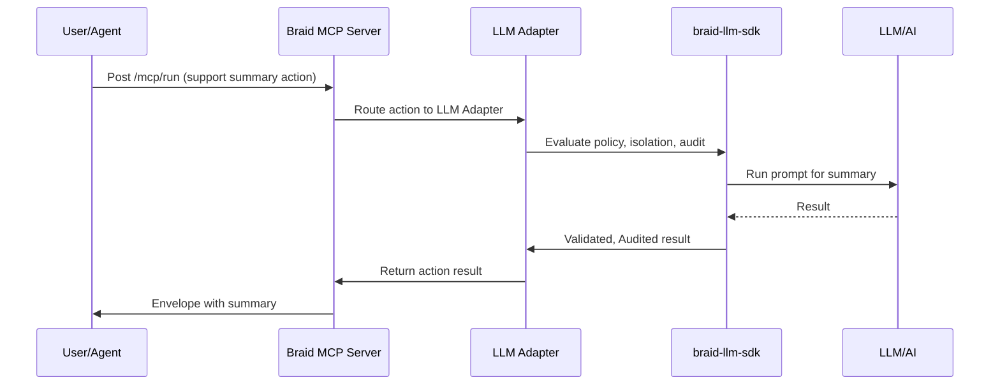

# Integrating `@braid/braid-llm-sdk` with a Braid MCP Server

This guide explains how to combine the [`@braid/braid-llm-sdk`](https://github.com/andreibyf/braid-llm-sdk) package with a generic Braid MCP server (like [`braid-mcp-server`](https://github.com/andreibyf/braid-mcp-server)) to enable secure, auditable, and robust AI-driven actions—including LLM-powered business automations—with strict policy, tenant isolation, and result validation.

---

## Why Integrate Both Package & Server?

Integrating `@braid/braid-llm-sdk` with the Braid MCP Server offers a unified, AI-enabled interface to your business systems. While not a requirement (the MCP server is fully functional without the LLM SDK), combining both provides:

- **AI Powered Automation:** Seamless automation of business processes and decision-support tasks using advanced language models.
- **Security & Compliance:** Fine-grained policy enforcement, tenant isolation, and auditing out-of-the-box—critical for enterprise adoption.
- **Pluggability:** You can enable, disable, or limit AI-backed actions per business need, without affecting conventional MCP flows.
- **Central Governance:** Observability, auditing, and control over all AI-related interactions from a single place.
- **Incremental Adoption:** Incorporate LLMs where useful, but maintain non-AI actions when AI isn’t appropriate or permitted.

> **Note**: You may use the MCP server independently for orchestration and integration, or layer in AI capabilities later as your enterprise requirements evolve.

---

## 📈 Visual Overview: Combined Architecture



---

## 1. Prerequisites

- A working Node.js or TypeScript environment.
- A Braid MCP Server project (see [`braid-mcp-server`](https://github.com/andreibyf/braid-mcp-server) for reference).
- The [`@braid/braid-llm-sdk`](https://github.com/andreibyf/braid-llm-sdk) package (from npm or a local path).
- (Recommended) Familiarity with Braid's action envelope concepts and your business system's confidentiality/authorization needs.

---

## 2. Installation

1. **Clone your MCP server:**
   ```bash
   git clone https://github.com/example/braid-mcp-server.git
   cd braid-mcp-server
   ```

2. **Install the SDK:**
   - If from local path:
     ```bash
     npm install ../braid-llm-sdk
     ```
   - Or, if published:
     ```bash
     npm install @braid/braid-llm-sdk
     ```

---

## 3. Create an Adapter Using the SDK

Add a new adapter—e.g., in `src/adapters/llmAdapter.ts`:

```typescript
import { runBraidLLMTool, enforcePolicy, auditAction, validateResult, getTenantContext } from "@braid/braid-llm-sdk";
import type { Action, ActionResult } from "../braid-types";
import type { Adapter, AdapterContext } from "../adapter-registry";

export const llmAdapter: Adapter = {
  system: "llm",
  async handle(action: Action, ctx: AdapterContext): Promise<ActionResult> {
    const tenantContext = getTenantContext(action);
    const policyCheck = enforcePolicy(action, tenantContext);
    if (!policyCheck.allowed) {
      auditAction(action, { event: "policy_denied", details: policyCheck.reason, tenant: tenantContext.id });
      return { actionId: action.id, status: "error", resource: action.resource, errorCode: "POLICY_DENIED", errorMessage: policyCheck.reason };
    }
    auditAction(action, { event: "llm_invoked", input: action.payload, tenant: tenantContext.id });
    try {
      const llmResult = await runBraidLLMTool({ prompt: action.payload.prompt, ...action.payload.options, tenant: tenantContext });
      const validResult = validateResult(llmResult, action.resource.kind);
      auditAction(action, { event: "llm_completed", success: validResult.valid, tenant: tenantContext.id });
      if (!validResult.valid) {
        return { actionId: action.id, status: "error", resource: action.resource, errorCode: "SCHEMA_VIOLATION", errorMessage: validResult.errors.join(", ") };
      }
      return { actionId: action.id, status: "success", resource: action.resource, data: validResult.data };
    } catch (err) {
      auditAction(action, { event: "llm_error", error: err?.message, tenant: tenantContext.id });
      return { actionId: action.id, status: "error", resource: action.resource, errorCode: "LLM_ERROR", errorMessage: err?.message ?? String(err) };
    }
  }
};
```

---

## 4. Register Your Adapter

```typescript
import { AdapterRegistry } from "./adapter-registry";
import { llmAdapter } from "./adapters/llmAdapter";
const registry = new AdapterRegistry();
registry.register(llmAdapter);
```

---

## 5. Example: Secure Braid Envelope for AI Actions

```json
{
  "requestId": "example-llm-1",
  "actor": { "id": "agent:dev", "type": "agent" },
  "createdAt": "2025-12-01T00:00:00Z",
  "client": "example-client",
  "channel": "dev",
  "actions": [
    {
      "id": "a1",
      "verb": "run",
      "actor": { "id": "agent:dev", "type": "agent" },
      "resource": { "system": "llm", "kind": "chat-completion" },
      "payload": {
        "prompt": "Summarize the Q4 CRM sales activities in 3 bullet points.",
        "options": {
          "temperature": 0.7,
          "max_tokens": 256,
          "redactSensitive": true
        }
      }
    }
  ]
}
```

---

## 6. Auditing, Policies, Tenancy, and Security

- **Auditing:** All actions, policy violations, and tool results are logged for compliance and debugging. Export logs for review if needed.
- **Policies:** Plug and tune policy modules to strictly govern data access, tool usage, and LLM invocation per tenant or use-case.
- **Tenant Isolation:** Safeguard against cross-tenant data leak by using built-in SDK isolation.
- **Schema-Driven Results:** Results and outputs have expected formats and will be rejected if they deviate, minimizing unpredictability from LLMs.
- **Integration:** Extend the SDK with custom hooks, audit sinks, or additional domains/tools for your context.

---

## 7. Advanced Usage and Extensibility

- Register new tool schemas and custom result validators in the SDK.
- Add hooks to policy or audit operations to tie into your existing risk/IT/compliance stack.
- See [`@braid/braid-llm-sdk` documentation](https://github.com/andreibyf/braid-llm-sdk#usage-examples) for further extensions.

---

## 8. Practical Use Cases

### Use Case 1: Automated Customer Support Summaries

**How it's incorporated:**  
- Integrate the LLM adapter as shown.  
- Configure Braid actions to forward chat transcripts or support tickets to the AI for summarization.  
- Policy module limits access so only non-sensitive fields are summarized; audit trail logs every invocation.  

**Result:**  
- Agents/clients receive concise, standardized AI-generated support summaries.  
- All summaries and accesses are logged for compliance.



---

### Use Case 2: Secure Financial Data Analysis

**How it's incorporated:**  
- AI tools are registered for financial forecasting, scenario planning, or compliance checks.  
- Policies restrict execution to authorized finance staff and redact sensitive account/client IDs in results.  
- All actions and LLM outcomes are validated against schemas to prevent accidental information leakage.

**Result:**  
- Actionable insights from the AI are securely delivered only to approved users.  
- Full audit trail for every analysis and strict clean-room controls.

```mermaid
flowchart LR
    A[Finance Staff] -->|Braid Action (Analysis Request)| MCP2[Braid MCP Server]
    MCP2 -->|LLM/AI Allowed Only for Finance| LLMAD2[LLM Adapter]
    LLMAD2 -->|Policy/Isolation| SDK2[Braid LLM SDK]
    SDK2 --|Policy Denied/Redacted Result|--> LLMAD2
    SDK2 -.-> LLM2[LLM/AI]
    LLM2 --|Data (no PII)|--> SDK2
    LLMAD2 --> MCP2
    MCP2 -->|Audited Result|--> A
```

---

## 9. Troubleshooting & Security Best Practices

- Ensure dependencies always up-to-date: `npm install`.
- Regularly review audit logs.
- Set strict env/configs for API keys, tenant contexts, etc.
- Add regression tests for custom adapters, policy, schema, or audit logic.

---

**Enjoy secure, compliant, and extensible AI orchestration with Braid and @braid/braid-llm-sdk!**